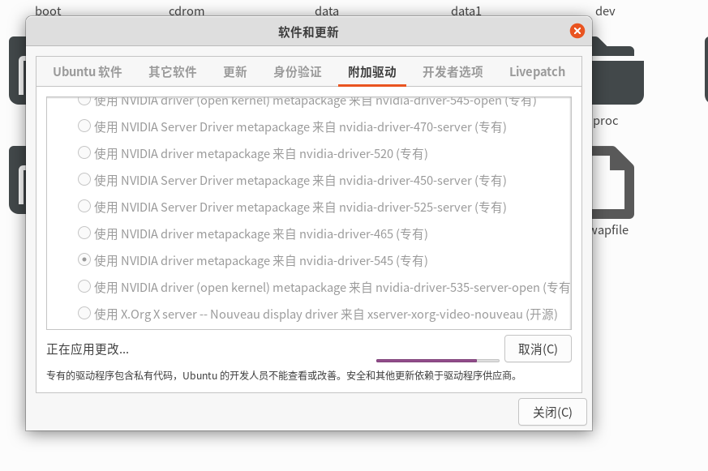

## 项目地址

https://github.com/liguodongiot/llm-action

https://github.com/liguodongiot/llm-action/tree/main/train/deepspeed

https://github.com/microsoft/DeepSpeedExamples/tree/master/training/HelloDeepSpeed

## 部署详情

使用DS训练模型bert

```
环境 esr

1.安装ds
pip install deepspeed
使用 ds_report  命令查看 DeepSpeed 环境报告(但是我不懂这些有什么用)
```


```
pip install protobuf==3.20.0
pip install mpi4py
pip install datasets==1.13.3
pip install transformers==4.5.1
pip install fire==0.4.0
pip install pytz==2021.1
pip install loguru==0.5.3
pip install sh==1.14.2
pip install pytest==6.2.5
pip install tensorboard
pip install packaging==21.3 -i https://pypi.tuna.tsinghua.edu.cn/simple/

Q:
`np.object` was a deprecated alias for the builtin `object`. To avoid this error in existing code, use `object` by itself. Doing this will not modify any behavior and is safe.
The aliases was originally deprecated in NumPy 1.20; for more details and guidance see the original release note at:
A:
更新tensorboard到最新版

Q:
packaging.version.InvalidVersion: Invalid version: '0.10.1,<0.11'
A:
packaging.version版本过高
降低packaging版本；
先尝试降低2个版本
pip install packaging==21.3 -i https://pypi.tuna.tsinghua.edu.cn/simple/

```

```
Q:
RuntimeError: Input tensor data type is not supported for NCCL process group: BFloat16

A:
NCCL 2.10.3 支持 bfloat16，如果 NCCL 版本 >= 2.10.3，PyTorch 进程组 nccl 将使用 blfoat16 输入。
升级NCCL,但是服务器的ubuntu版本高，20.04，对应的cuda版本很低，10.2，这个组合没有对应的NCCL自动安装包，需要手动安装，麻烦的很，要改软链接的对应关系

https://blog.csdn.net/Scenery0519/article/details/128081062


```


```
查看cuda路径
whereis cuda

查看cuda版本
cat /usr/local/cuda/version.txt


```


```
231220
看网上的教程说，虚拟环境可以有自己的cuda和cudnn，安装pytorch时会自动安装，试验一下

1.检查显卡最高支持的cuda版本
nvidia-smi

11.0

2.新建环境
conda create -n dp_cuda11 python=3.8 


3.安装troch
pip install torch==1.7.1+cu110 torchvision==0.8.2+cu110 torchaudio==0.7.2 -f https://download.pytorch.org/whl/torch_stable.html


4.检查cuda版本
print(torch.version.cuda)
# 11.0
print(torch.backends.cudnn.version())
# 8005
还真的升级了

x = torch.rand(5, 3)
print(x)
```

```
新的问题
Q:
  File "/home/ailab/miniconda3/envs/dp_cuda11/lib/python3.8/site-packages/torch/distributed/distributed_c10d.py", line 223, in _get_group_size
    raise RuntimeError("The given group does not exist")
A:
网上说可能是torch的版本低了
但是服务器上装的显卡驱动版本太低，还不敢乱更新，450版本的显卡驱动最高只支持到cuda11.0
而11.0的cuda最高支持torch1.7

网上说的至少要更新到1.8


```


```
numactl 装不上
更新 apt
sudo apt update
sudo apt -y install numactl
```


```
服务器显卡驱动更新

之前安装会提示：
pk-client-error-quark:The following packages have unmet
dependencies:
libnvidia-encode-440:libnvidia-encode-450 but it is not going to
be installed
libnvidia-gl-440::libnvidia-gl-450 but it is not going to be installed
libnvidia-fbcl-440:依赖：libnvidia-fbcl-450 but it is not going to be
installed
libnvidia-decode-440::libnvidia-decode-450 but it is not going to
be installed
libnvidia-ifrl-440:依赖：libnvidia-ifrl-450 but it is not going to be
installed
libnvidia-common-440:依赖：libnvidia-common-450 but it is not
going to be installed
(268)

看网上的说法是之前装的包有冲突

https://askubuntu.com/questions/1288124/how-to-remove-conflicting-nvidia-packages-and-unmet-dependencies

sudo apt autoremove
用这条命令后清除存在问题的包，再执行命令，可以安装
但是好像卡住了，不知道能不能装好
```



主要是也不敢退出，就一直放这里吧


```
装上了，但是
Failed to initialize NVML: Driver/library version mismatch
NVML library version: 545.23

reboot
重启正常，显示，直接使用系统自带的驱动软件安装很靠谱

conda create -n dp_torch_2.1.1 python=3.8 

conda install pytorch==2.1.1 torchvision==0.16.1 torchaudio==2.1.1 pytorch-cuda=12.1 -c pytorch -c nvidia
直接装最新的torch，装的好慢啊

验证时报错了，但是测试torch时是正常的，不清楚是什么问题

```

```
切换cuda版本
https://blog.csdn.net/JianJuly/article/details/102793103

安装cuda
https://developer.nvidia.com/cuda-downloads

https://developer.nvidia.com/cuda-toolkit-archive

设置cuda_home
export CUDA_HOME=/usr/local/cuda-11.8/

检查cuda_home
import torch
import torch.utils.cpp_extension
torch.utils.cpp_extension.CUDA_HOME
```


```
231222
现在的问题是，ds检测到的系统cuda和环境的cuda不匹配

尝试修改系统cuda，系统cuda已经被修改到12.3，可ds仍然报错，说是基于10.3的cuda进行编译的

而且base的cuda不能使用

sudo reboot

conda create -n ds_pt_2.0.1_py3.8_t python=3.8
这里的python3.10好像有问题，确实是3.10的问题，3.10装不上transforms，3.8没问题，不知道为什么？

conda env remove --name ds_pt_2.0.1_py3.8

pip install torch==2.0.1 torchvision==0.15.2 torchaudio==2.0.2

推荐使用pip 安装

报错
SafetyError: The package for libuuid located at /home/ailab/miniconda3/pkgs/libuuid-1.41.5-h5eee18b_0
appears to be corrupted. The path 'lib/libuuid.so.1.3.0'

ailab@ailab-X299-WU8:~/miniconda3/pkgs$ rm -rf libuuid-1.41.5-h5eee18b_0

rust安装（莫名其妙这个咋没有了？）
https://zhuanlan.zhihu.com/p/308452799

# 231229
切换cuda版本后可算跑起来了

正确环境ds_pt_2.0.1_py3.8
这个环境其实和之前相比没有什么不同，只是将系统cuda修改到了11.8
主要还是设置cuda_home
export CUDA_HOME=/usr/local/cuda-11.8/
这个命令起作用
```


```
新问题：
    raise RuntimeError("Ninja is required to load C++ extensions")
RuntimeError: Ninja is required to load C++ extensions

服务器正常运行，但是pycharm不行

Ninja已经装在环境里了
(ds_pt_2.0.1_py3.8) ailab@ailab-X299-WU8:/data1/hqp_w/Hello_Deepspeed$ which ninja
/home/ailab/miniconda3/envs/ds_pt_2.0.1_py3.8/bin/ninja

说是系统变量的问题
按教程改了pycharm的设置，但是没有起作用

直接换一个环境是不是就好了？之前也没遇到过
换一个新的环境也不行

Please run following command:

wget https://github.com/ninja-build/ninja/releases/download/v1.8.2/ninja-linux.zip
sudo unzip ninja-linux.zip -d /usr/local/bin/
sudo update-alternatives --install /usr/bin/ninja ninja /usr/local/bin/ninja 1 --force 

solution from https://www.claudiokuenzler.com/blog/756/install-newer-ninja-build-tools-ubuntu-14.04-trusty#.XEDUk89KjOB

按照这方法装上了

但是又出现新的问题

  File "/home/ailab/miniconda3/envs/ds_pt_2.0.1_py3.8_t/lib/python3.8/site-packages/torch/utils/data/_utils/fetch.py", line 51, in <listcomp>
    data = [self.dataset[idx] for idx in possibly_batched_index]
  File "/data1/hqp_w/Hello_Deepspeed/train_bert_ds.py", line 212, in __getitem__
    tokens, labels = self.masking_function(self.dataset[idx]["text"])
  File "/data1/hqp_w/Hello_Deepspeed/train_bert_ds.py", line 144, in masking_function
    int((mask_prob * (high - low)) + np.random.rand()), 1)
TypeError: can only concatenate str (not "float") to str

同样，服务器上是正常运行的

答案是直接在pycharm上运行的是没有调用deepspeed的框架，直接使用的是python，这就导致一些本来应该由框架完成的操作，现在做不了了

如果想要调试ds代码，只有使用vscode试试了

使用vscode可以调试

https://blog.csdn.net/weixin_38252409/article/details/134992123

```


```
教程里没有直接使用官方的bert进行预训练的，他们使用的是英伟达发布的剪枝过的bert，这个版本的bert的优点在于有别人写好的deepspeed的配置，可以直接调用；如果不用的话就得自己写

但是缺点是还要安装tf，tf能不能装上还是个问题
安装tf 成功
https://tensorflow.google.cn/install/pip?hl=zh-cn#ubuntu-macos


```

```
https://github.com/nvidia/apex

apex安装，需要注意torch 和 nvcc 的cuda版本一致问题
pip install -v --disable-pip-version-check --no-cache-dir --no-build-isolation --global-option="--cpp_ext" --global-option="--cuda_ext" ./


但是出现新问题
ModuleNotFoundError: No module named 'fused_layer_norm_cuda'
这个说是因为环境的cuda和torch的cuda不匹配


在环境里输入 nvcc -V 显示11.8
torch 的cuda版本是11.7，于是安装11.8的torch
pip install torch==2.1.1 torchvision==0.16.1 torchaudio==2.1.1 --index-url https://download.pytorch.org/whl/cu118

版本一致后，卸载sudo pip uninstall apex

重新安装apx
```


## 小结

```
20240103
最终还是把deepspeed给部署起来了，没有完全按照BingBertGlue的代码去部署，有一部分他的代码我跑不通

后面又看了一下HelloDS的代码，发现他的代码很简单，只是在原来的基础上加了ds相关的设置用deepspeed.initialize对模型和优化器进行初始化，然后在反向传播和优化器迭代有不同
而BingBertGlue很复杂，他使用了剪枝优化后的预训练模型，并且没有使用ds自带的优化器

我把多卡分布训练想的复杂了，主要的工作都是由ds框架完成的

但是剪枝模型的分类结果比正常的模型要弱（模型剪枝我不太懂，也可能是没有设置好）

```

```
虽然跑起来了，但是还有问题
1.ds保存的模型格式和之前的方式不同，也没有调用过保存的模型
2.没有详细的对比使用ds和单卡运行的时间效率和微调模型的性能
3.训练模型打印的信息会重复，没有完全按照ds训练流程，这里需要重新修改代码
```

